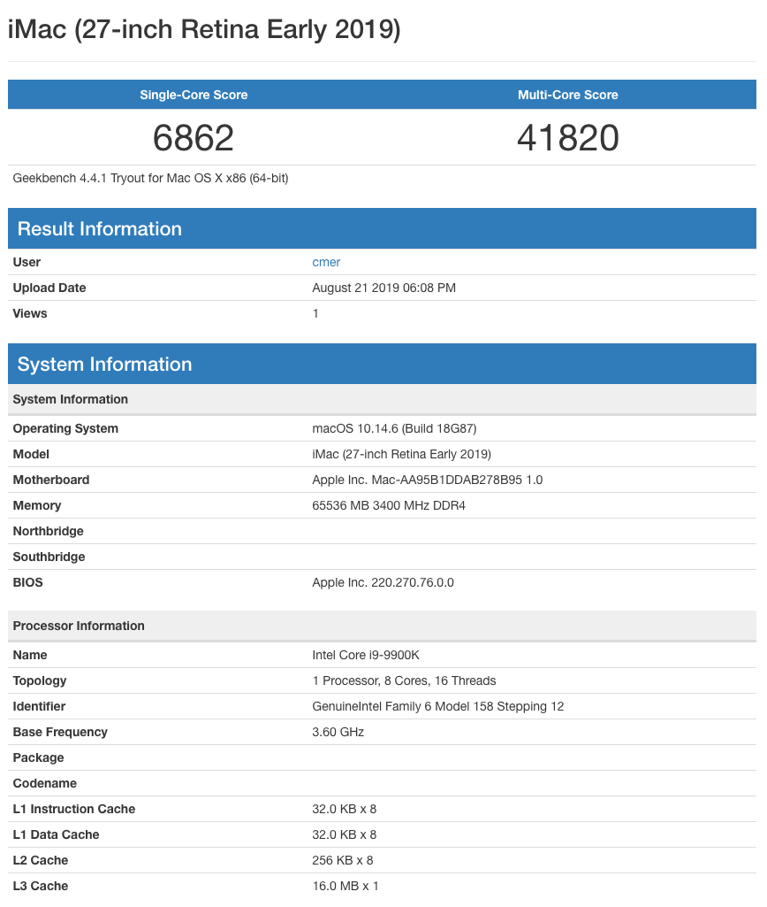

# BIOS Settings

Here are the minimum BIOS settings you'll need for a fully functional macOS Mojave/Catalina setup.

Before you start, make sure to upgrade your BIOS to the latest version (I use F8) and **Load Optimized Defaults**.

## M.I.T

### Advanced Frequency Settings

* Extreme Memory Profile (XMP): Profile1

## Peripherals

### Super IO Configuration

* Serial Port: Disabled

### USB Configuration

* XHCI Hand-off: Enabled

## Chipset

* Internal Graphics: Disabled

# Overclocking

These are the additional settings I used to overclock my i9 9900k to 5.1GHz.

## M.I.T

### Advanced Frequency Settings

* CPU Clock Ratio: 51
* Extreme Memory Profile (XMP): Profile1

#### Advanced CPU Core Settings
* Uncore Ratio: 47
* Package Power Limit1 - TDP (Watts): 4090
* Package Power Limit2 (Watts): 4090
* Platform Power Limit1 (Watts): 4090
* Platform Power Limit2 (Watts): 4090
* CPU Enhanced Halt (C1E): Disabled
* C3 State Support: Disabled
* C6/C7 State Support: Disabled
* C8 State Support: Disabled
* C10 State Support: Disabled

### Advanced Memory Settings
  * Extreme Memory Profile (XMP): Profile1

### Advanced Voltage Settings

#### Advanced Power Settings
* CPU Internal AC/DC Load Line: Turbo
* CPU Vcore Loadline Calibration: Turbo
* VAXG Loadline Calibration: Turbo
* CPU Vcore Current Protection: Turbo
* VAXG Current Protection: Turbo

#### CPU Core Voltage Control
* CPU Vcore: 1.370V
