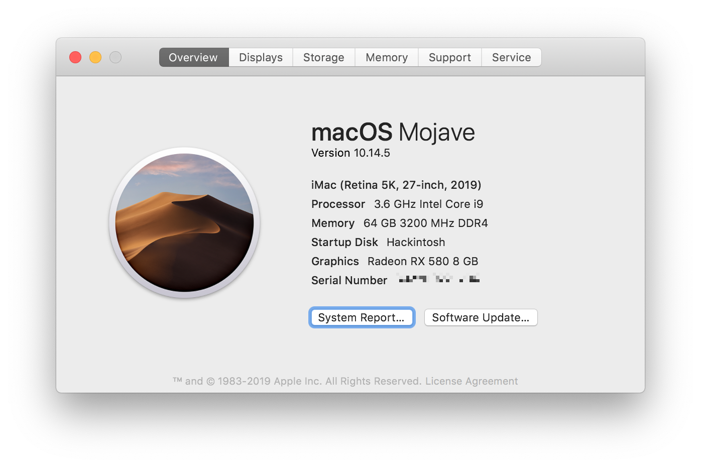

# Hackintosh Mojave Installation Guide for Gigabyte Z390 Aorus Master

This build is "Vanilla". I used [this guide](https://hackintosh.gitbook.io/-r-hackintosh-vanilla-desktop-guide/) as a starting point.

### Hardware

See my [Hardware List](HARDWARE.md)

### What's Working/What's Not

##### Working
- Ethernet
- Audio (including digital audio)
- APFS
- Sleep/Wake
- Headless iGPU with native support for Quicklook and Preview, and Final Cut Pro X.
- All USB ports (USB 3 speed working)
- iMessage
- App Store
- Facetime
- APFS
- Handoff
- Bluetooth & Wi-Fi (via Broadcom adapter. Also works in UEFI and Clover.)
- Unlock with Apple Watch
- Airdrop
- AirPlay
- Continuity
- Apple Music (iTunes)
- Power Nap

##### Not Working
- iGFX HDMI output during install. Common problem, nobody seems to have found a solution. But I don't need it. (NOTE: this might now be working with 10.14.5 since support for the 9900k is now built in. I haven't tried again since.)
- Built-in wifi. This will likely never work since it is the new Intel CNVi that MacOS doesn't support.
- Onboard Bluetooth is hit or miss. However, I disabled it (HS14) because I have a natively supported Broadcom BCM94360CS2 WIFI/BT adapter.
- Netflix DRM in Safari (works in Chrome)
- DRM-protected video in iTunes (ie: purchased TV shows)

##### Not Yet Tested
- FileVault

### Step By Step Instructions

See [STEP_BY_STEP.md](STEP_BY_STEP.md)

### USB Port Map & SSDT

See [USB_MAP.md](USB_MAP.md) for a map of all the ports on the Aorus z390 Master.

### The Lazy Way

You are welcome to use my config.plist and kexts. However, make sure you set the following:

- SerialNumber
- BoardSerialNumber
- SmUUID
